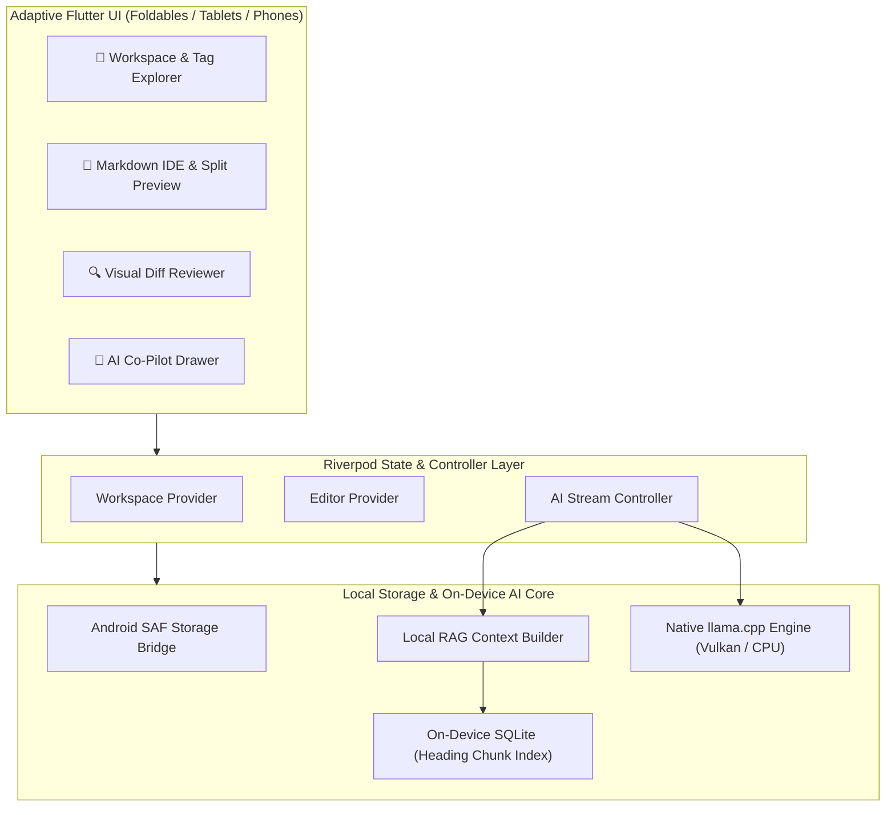

<div align="center">

# 🪶 Quill & Papyrus AI

### The Air-Gapped, On-Device AI Markdown IDE for Android

**100% Offline • Native GGUF via `llama.cpp` • Vulkan GPU Acceleration • Local RAG • Zero Telemetry**

[](LICENSE)
[](https://android.com)
[](android/app/src/main/AndroidManifest.xml)
[](https://github.com/ggerganov/llama.cpp)
[](https://flutter.dev)

</div>

---

## 🌟 Why Quill & Papyrus AI?

Most modern "AI writing" apps are thin wrappers around cloud APIs: they require costly monthly subscriptions, log your keystrokes, and beam confidential notes, journals, and drafts to remote servers.

**Quill & Papyrus AI takes the opposite approach.** It is a dedicated, local-first Markdown IDE specifically engineered for Google's on-device **Gemma 4** architectures (**Gemma 4 E2B** and **Gemma 4 E4B**) executing **directly in your phone's memory** using native C++ `llama.cpp` and Vulkan GPU acceleration.

* 🚫 **No subscriptions or accounts**
* 🔒 **Zero internet access:** The release [`AndroidManifest.xml`](android/app/src/main/AndroidManifest.xml) explicitly omits `android.permission.INTERNET`. The Android operating system physically forbids the app from making outbound network calls.
* ⚡ **Private Document Intelligence:** Your writing never leaves your silicon.

---

## 🚀 Key Features

* **⚡ Native GGUF Inference Engine:**
  Direct native bindings to `llama.cpp` via Vulkan GPU offloading and CPU multi-threading. Load any standard 4-bit or 8-bit `.gguf` model file on your phone.
* **🧠 Heading-Aware Local RAG:**
  Automatically chunks your Markdown workspace files by `# Headings`, extracts YAML frontmatter tags, and indexes them in a local SQLite database for context-aware questions and drafting.
* **📱 Foldable & Tablet Optimized:**
  Adaptive **3-Pane Tri-View** layout engineered for inner foldable screens (e.g., Samsung Galaxy Z Fold series) and Android tablets:
  * **Left:** Workspace file explorer & frontmatter tag index.
  * **Center:** Multi-mode editor (Source, Live Split View, and Rich Preview).
  * **Right:** AI Co-pilot drawer with real-time token streaming and prompt templates.
  * *Gracefully collapses to a compact single-pane view on standard phone displays.*
* **🔍 Visual AI Diff Review:**
  Compare AI-generated suggestions side-by-side against your existing text with color-coded diff gutters before choosing to Accept or Reject changes.
* **🏷️ YAML Frontmatter & Tag Explorer:**
  Parse, edit, and filter documents by tags, creation dates, and metadata directly in the workspace sidebar.
* **📁 Android Storage Access Framework (SAF):**
  Open and edit Markdown vaults directly on your device storage or SD card without locking you into proprietary database silos.

---

## 🏗️ Architecture



---

## 🧠 Recommended Models & Hardware Matrix

Because the app is strictly air-gapped, you provide your own `.gguf` model weights. Quill & Papyrus AI is tailored and prompt-formatted specifically for Google's **Gemma 4** mobile architectures:

| Model | Profile | Quantization | Size on Disk | Minimum RAM | Best Suited For |
| :--- | :--- | :--- | :--- | :--- | :--- |
| **Gemma 4 E2B** | Low-Power / High-Speed | `Q4_K_M` | ~1.5 GB | 4 GB | High-speed drafting, proofreading, document summaries, battery-efficient editing |
| **Gemma 4 E4B** | Primary / Deep Context | `Q4_K_M` | ~2.7 GB | 6 GB - 8 GB+ | Complex document synthesis, multi-turn RAG reasoning, long-form Markdown outlining |

> 💡 **Tip for Best Performance:**
> * **Standard Smartphones:** **Gemma 4 E2B** provides rapid, fluid token streaming with minimal battery impact and low thermals.
> * **Foldables & Tablets:** (e.g., Samsung Galaxy Z Fold series with 12 GB RAM) **Gemma 4 E4B** delivers full-fidelity deep reasoning across large Markdown workspaces.

---

## 📲 Setup & Model Sideloading

1. **Install the APK:**
   Download the latest `app-release.apk` from [Releases](https://github.com/Herdingnomad/QuillPapyrusAI/releases).
2. **Download a Model File:**
   Download any `.gguf` model from Hugging Face using your mobile browser or transfer one from your PC.
3. **Place the Model:**
   Save the `.gguf` file to your device's model folder:
   ```text
   /storage/emulated/0/Documents/QuillPapyrus/models/
   ```
   *(Alternatively, tap the **Model Selection** button inside the app and choose your `.gguf` file with the system file picker).*
4. **Open a Workspace:**
   Select any local folder containing Markdown (`.md`) files. The app will index headings for RAG and launch the editor.

---

## 🛠️ Building from Source

### Prerequisites
* [Flutter SDK](https://docs.flutter.dev/get-started/install) (`>= 3.12`)
* [Android SDK](https://developer.android.com/studio) (API 34+) and Android NDK
* Java 17

### Build Commands

```bash
# 1. Clone the repository
git clone https://github.com/Herdingnomad/QuillPapyrusAI.git
cd QuillPapyrusAI

# 2. Fetch packages
flutter pub get

# 3. Analyze codebase
flutter analyze

# 4. Build optimized Release APK
flutter build apk --release
```

The output APK will be located at:
```text
build/app/outputs/flutter-apk/app-release.apk
```

---

## ❓ Frequently Asked Questions (FAQ)

<details>
<summary><b>Why doesn't the app download models inside the app?</b></summary>
Because Quill & Papyrus AI has <b>zero network permissions</b> in its release manifest. Enabling in-app downloads would require granting internet access, which breaks the verified air-gap guarantee. Keeping model management user-controlled ensures total transparency.
</details>

<details>
<summary><b>Will running models drain my battery or overheat my phone?</b></summary>
Inference only runs when you explicitly submit a prompt or request a text transformation. The app automatically disposes of active inference threads when idle, preventing background battery consumption.
</details>

<details>
<summary><b>What happens if I don't have a GGUF model loaded?</b></summary>
The app includes a deterministic, offline rule-based assistant fallback that can still help with basic document outlining and templating while you choose your model file.
</details>

---

## 🤝 Contributing

Contributions, issues, and feature requests are welcome!
Feel free to check the [Issues page](https://github.com/Herdingnomad/QuillPapyrusAI/issues) or read [`CONTRIBUTING.md`](CONTRIBUTING.md) to get started.

---

## 📄 License

This project is licensed under the [MIT License](LICENSE) — see the [`LICENSE`](LICENSE) file for details.
